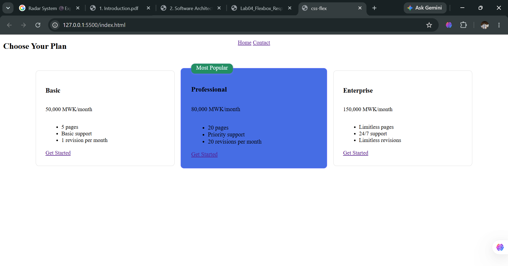

Student Name: Doreen Providence Abel
Student ID  : BECE/21/SS/001

Error 1
Navbar links had no underline and were not clickable.

Root Cause 
no underline and weren't clickable	Used <nav aria-label="#home">Home</nav> — <nav> is a sectioning/landmark element, not a link. aria-label only names an element for screen readers; it doesn't create navigation behavior.

Fix 
Wrapped actual <a href="#home">Home</a> elements inside the <nav>, and moved the URL from aria-label into href where it belongs.

Error 2
Navbar items stacked top-let instead of spreading across the bar

Root Cause
.navbar had position: fixed sizing/placement but no display: flex — child elements defaulted to normal block/inline flow with no spacing logic.

Fix 
fixed sizing/placement but no display: flex — child elements defaulted to normal block/inline flow with no spacing logic.	Added display: flex; justify-content: space-around; align-items: center; to .navbar.

Error 3
flex-wrap: wrap set on .container but nothing wrapped

Root Cause
Wrap only triggers when items overflow available width. .container had no width/max-width, so at typical window widths all items fit on one line — there was no overflow to trigger wrapping.

Fix 
Added max-width to .container to force overflow at a testable width, and confirmed by narrowing the actual browser window.

Error 4
Badge for "Most Popular" needed to sit in the corner of the featured pricing card, not the whole page

Root cause
position: absolute positions relative to the nearest ancestor with position set to anything other than static. Without position: relative on .plan.featured, the badge would fall back to positioning against the whole document.

Fix 
Set position: relative on .plan.featured to establish it as the positioning context, then position: absolute; top: -12px; right: -12px; on .badge.

The concept i found the hardest to understand was: using the Devtools to navigate through the differnt screens sizes
One question I still have : My question is on inline element if its blocks or boxes are they aslo responsive that they can be updated to columns each separately or maybe they shrink?
My Browser output screnshot filename: 
